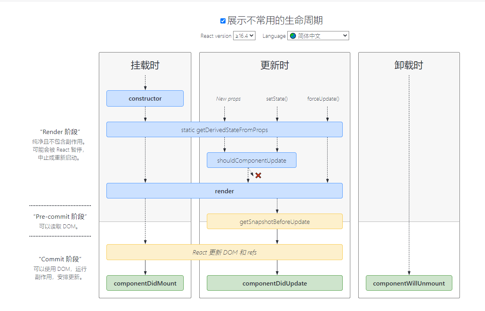

##  18.2.0

[生命周期](https://zh-hans.reactjs.org/docs/react-component.html)

### 挂载阶段

当组件实例被创建并插入 DOM 中时，其生命周期调用顺序如下：   
1. constructor
2. static  getDerivedStateFromProps
3. render
4. componentDidMount

### 更新阶段

当组件的 props 或 state 发生变化时会触发更新。组件更新的生命周期调用顺序如下:   
1. static getDerivedStateFromProps
2. shouldComponentUpdate
3. render
4. getSnapshotBeforeUpdate
5. componentDidUpdate

### 卸载阶段

当组件从 DOM 中移除时会调用如下方法：
1. componentWillUnmount

### 错误处理

当渲染过程，生命周期，或子组件的构造函数中抛出错误时，会调用如下方法：
- static getDerivedStateFromError
- componentDidCatch
